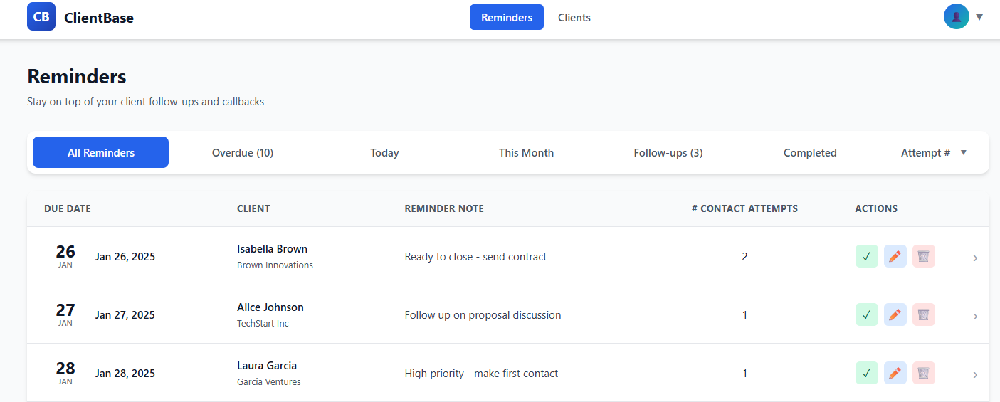
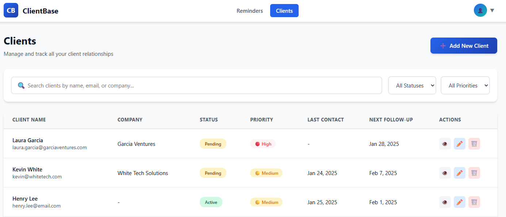

# ClientBase
A client management system that tracks appointment attempts through a structured contact workflow. Users create reminders for client outreach, record each interaction and its outcome, then seamlessly schedule follow-ups or move to the next booking cycle. Data capture supports future analytics features.

## Live Demo
Users can register an account  
**Link:** https://clientbaseapp.com

## Run It Locally
### Prerequisites
- nodejs v18+
- mariaDB/MySQL
- npm

### Quick Start
1. Clone the repository
```bash
   git clone https://github.com/timhadler/client-base.git
   cd client-base
```

2. Install dependencies
```bash
   npm install
```

3. Set up database
```bash
   mysql -u root -p
   CREATE DATABASE clientbase;
   USE clientbase;
   SOURCE database/schema.sql;
   # Optionally use seed data
   SOURCE database/seed.sql;
```

4. Configure environment
```bash
   cp .env.example .env
   # Edit .env with your database credentials
```

5. Start the server
```bash
   npm start
```

6. Visit `http://localhost:3000`  
If using seed data, user credentials:  
    - **username:** demo@clientbase.com  
    - **password:** DemoPass@123

---

## Tech Stack
- **Backend:** Node.js, Express
- **Authentication:** Passport.js (session-based)
- **Frontend:** EJS, CSS
- **Client-side:** JavaScript, jQuery, AJAX
- **Database:** MariaDB
- **Sessions:** Express-session

## Further Development
Plans for further development can be found in management/Further Development.md

## Screenshots
<p align="center">
  
  
  
</p>
